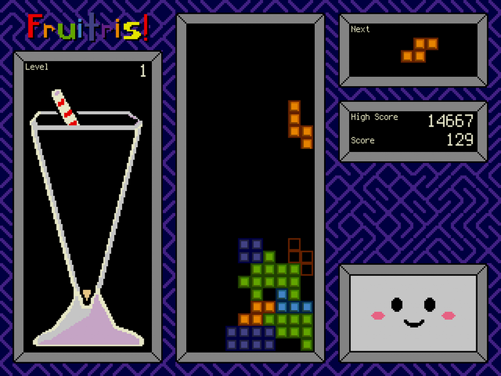

# Fruit_Jam_Fruitris
Tetris, _**Fruit Jamified!**_

## Controls

| Action           | Keyboard      | Gamepad | Buttons             |
|------------------|---------------|---------|---------------------|
| Move Left        | Left Arrow    | Left    | Button #1           |
| Move Right       | Right Arrow   | Right   | Button #3           |
| Rotate Clockwise | Up Arrow or X | Up or A | Button #2           |
| Drop: Soft       | Down Arrow    | Down    | Button #2 & #3      |
| Drop: Hard       | Z             | B       | Button #1 & #3      |
| Pause            | Enter         | Start   | Button #1 & #2      |
| Quit (reload)    | Escape        | Select  | Button #1 & #2 & #3 |

## Credits

Special thanks to the following contributors of this project:
- S. Earley (@sammwich96) for helping with artwork
- Sam Blenny (@samblenny) for assistance with USB host gamepad support
- @RetiredWizard for improved hardware button mapping and launcher config support
